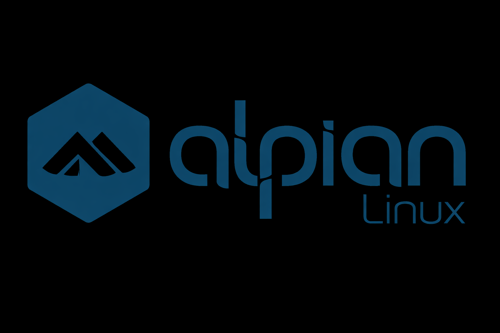

# alpian



## Overview

This project is based on [Alpine Linux](https://alpinelinux.org) and extends the basic ramdisc deployment to also include u-boot and Linux kernel build helpers for multiple AArch64 SBC's.  The Rdaxa devices in particular often have outadted or odd build frameworks, and each SBC often gets an a different framework with no backporting.

Rather than fight with the manufacturer tooling, this project has been created to offer a very similar base O/S experience across a range of accessible AArch64 SBC's, and to make it easier to configure the O/S via custom APK's so that creating a tailored O/S is potentially easier than trying to cut down a more fully featured Linux system to fit on smaller install media.

The focus is on long-term headless reliability in deployments where power supplies and networking at not provided with any guarantees - by utilising a ramdisc base system, and by offering an easier way in to wrangling OverlayFS tool deployments, the SBC's can survive unexpected outages without risk of file system corruption.  By utilising the Alpine Linux `lbu` command, customisation can be kept for a specific machine, wven with an ephemeral root image.

For full build/run details, see [src/README.md](./src/README.md), and for simplified comntainerised building see [src/CONTAINER-BUILD.md](./src/CONTAINER-BUILD.md).

## Directory Layout

- `scripts/`
  - Build and packaging entry points (kernel, rootfs, image assembly, APK repo, SPI U-Boot, USB updater).
- `assets/`
  - Version-controlled reference inputs (configs, DTS patches, package lists, MOTD templates, keys).
- `boards/`
  - Board-specific profiles and overrides. Use `BOARD=<name>` for builds (default: `e54c`).
  - Supported board profiles: `e54c`, `rock5b`, `rock3b`, `r3s`, `rpi4`.
  - Includes shared Alpine package lists in `boards/alpian/alpine/` plus board overlay lists in
    `boards/<board>/alpine/`, and
    U-Boot fetch profiles (`boards/<board>/u-boot-fetch.env`).
- `apk/`
  - Custom Alpine APK package sources (`APKBUILD` + service payload files).
- `src/`
  - Project documentation and (optionally) local kernel checkout(s).
- `tests/`
  - Test helpers/placeholders.
- `build/`
  - Generated artifacts and temporary build state.
- `work/`
  - Scratch area (legacy/manual workflows), not required by the default scripted pipeline.
- `.git/`
  - Git metadata.

## Auto-Populated / Safe-To-Delete Directories

These can be removed and will be recreated by scripts when needed.

- `build/`
  - Recreated by all build scripts (`scripts/build-*.sh`, `scripts/prepare-alpian-rootfs.sh`, `scripts/assemble-image.sh`).
  - Contains outputs like kernel artifacts, rootfs tarball, image files, APK repo, U-Boot build trees.
- `src/radxa-kernel-<board>/`
  - Recreated by `scripts/fetch-radxa-kernel.sh` (called by `scripts/build-kernel.sh`) for Radxa-source boards.
  - This is a local git clone of the Radxa kernel branch.

## Safe-To-Delete But Not Script-Critical

- `work/`
  - Safe to remove.
  - Not part of the default build path; current main scripts do not require it.

## Regenerating U-Boot Reference Blobs

If `boards/<board>/u-boot/idbloader.img` or `boards/<board>/u-boot/u-boot.itb`
are missing, repopulate them with:

```bash
scripts/fetch-uboot-reference-assets.sh
```

Boards that use firmware-native boot (`BOARD=rpi4`) do not inject SPI U-Boot.  
For those boards, the same script creates harmless placeholders so `make` targets remain uniform.

## Most Common Operating Sequence

```bash
BOARD=e54c scripts/check-tooling.sh
BOARD=e54c scripts/fetch-uboot-reference-assets.sh
BOARD=e54c scripts/build-apk-repo.sh
BOARD=e54c scripts/build-kernel.sh
BOARD=e54c scripts/prepare-alpian-rootfs.sh
BOARD=e54c scripts/assemble-image.sh
BOARD=e54c scripts/build-usb-updater-image.sh
```

Equivalent with `make`:

```bash
make BOARD=e54c images
make BOARD=rock5b images
make BOARD=rock3b images
make BOARD=r3s images
make BOARD=rpi4 images
```

Explicit sequence:

```bash
scripts/check-tooling.sh
scripts/fetch-uboot-reference-assets.sh
scripts/build-apk-repo.sh
scripts/build-kernel.sh
scripts/prepare-alpian-rootfs.sh
scripts/assemble-image.sh
scripts/build-usb-updater-image.sh
```

## Notes

- `.gitignore` already marks generated trees (`build/`, `work/`, `src/radxa-kernel/`, `src/radxa-kernel-*`) as non-tracked.
- If disk space cleanup is needed, deleting `build/` is the highest-impact safe reset.

# Copyright and Licence

Code created by the project &copy; 2026 Ian Spray and is MIT licenced (see [LICENCE.md](LICENCE.md) for details).

There may be signifcant amounts of non-project code present as this tool modifies many other projects, and for those portions the original licence of that code still applies.
